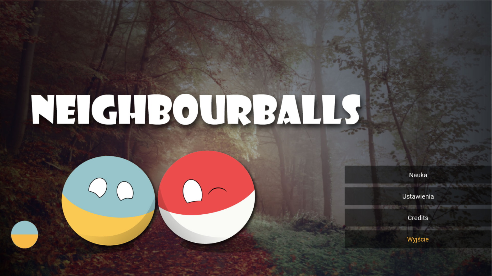
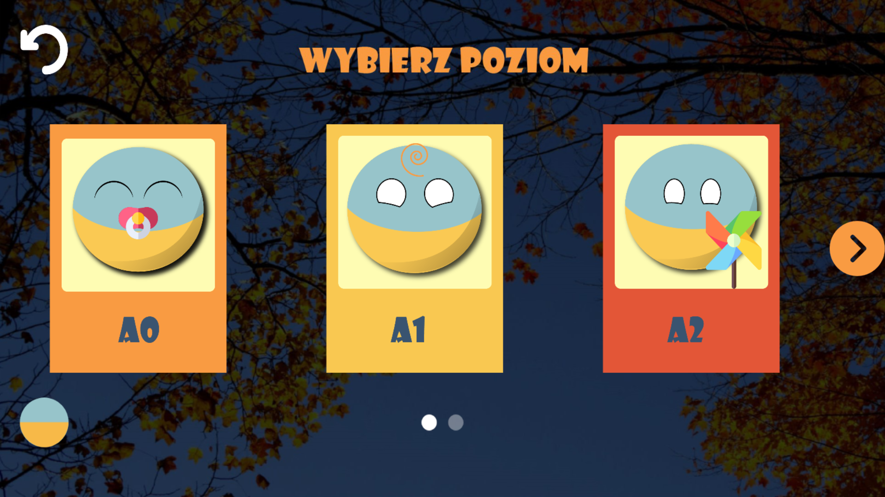
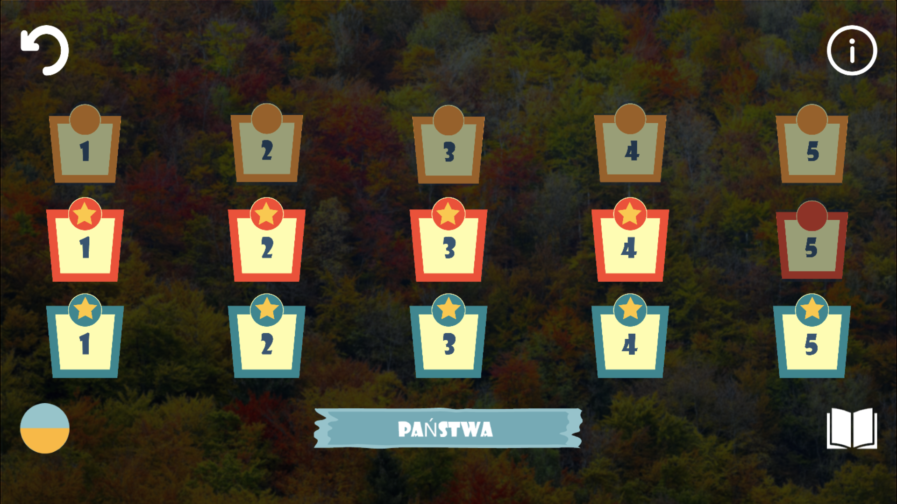
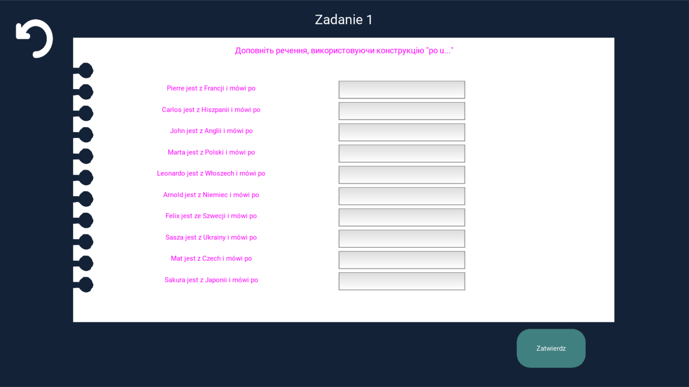
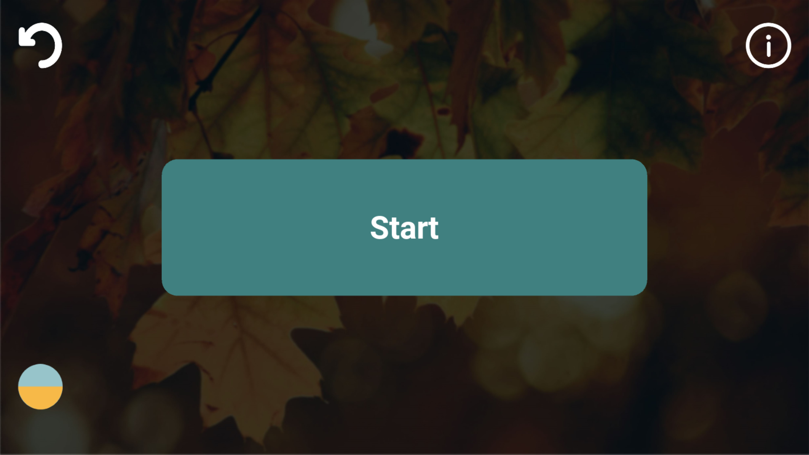
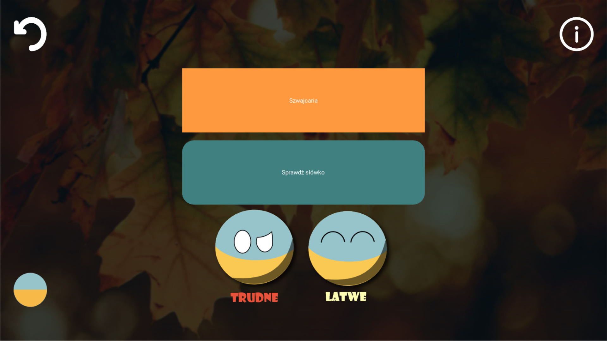
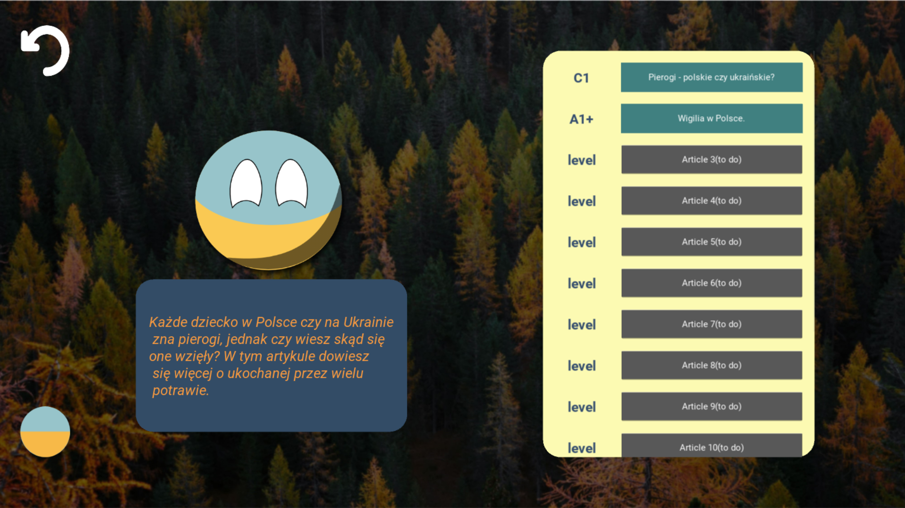
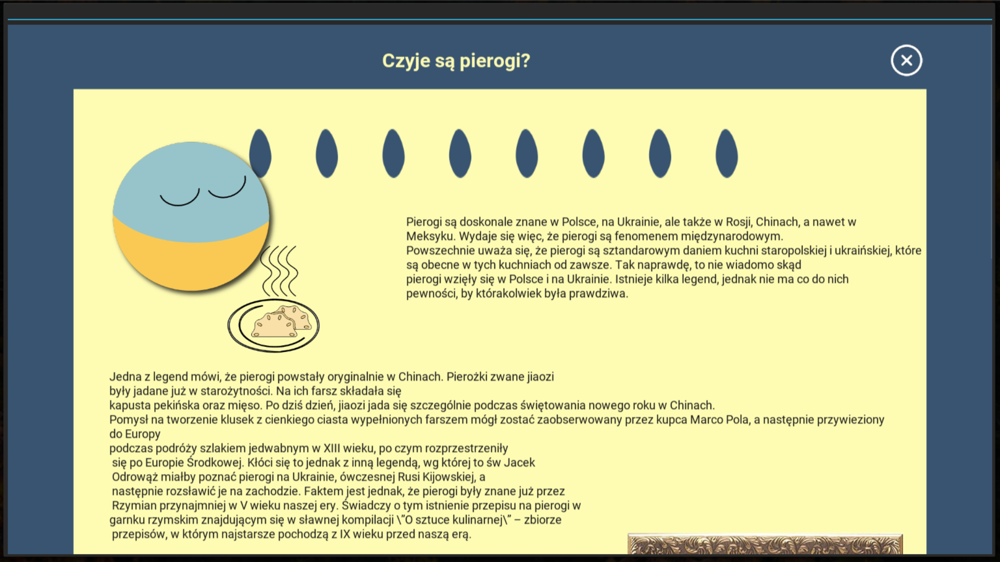

# Project Name
> Neighbourballs: Language exchange alpha version

## Table of contents
* [Technologies](#technologies)
* [Setup](#setup)
* [Features](#features)
* [Screens](#screens)
* [Status](#status)

## Technologies
* Python - version 3.7
* Kivy - version 1.11

## Setup
Previously set up python and kivy environment.
Kivy [set up](https://kivy.org/doc/stable-1.11.0/installation/installation-windows.html)
To execute application, clone [repo](https://github.com/Anastasiya999/NeighbourBalls_app.git), launch terminal in current directory and write command:
python main.py

## Code Examples
Show examples of usage:
`put-your-code-here`

## Features

* Interactive language learning 
* User-friendly interface
* Multi-level approach
* Wide range of topics and tasks
* Gamification elements(achievements, trials and temporaly blocking tasks)
* Flashcards
* Interesting facts

## Screens

### Landing page

### Study screen

### Choose level

### Task panel

### Task screen

### Flashcards

### Interesting facts

## Status
Project is:  suspended for a while

